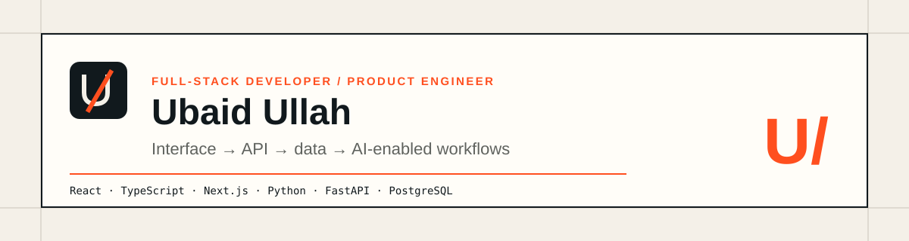

  

  <a href="https://my-portfolio-website-plum-theta.vercel.app/"><strong>Portfolio</strong></a>
  &nbsp;·&nbsp;
  <a href="https://www.linkedin.com/in/ubaid-ullah-/"><strong>LinkedIn</strong></a>
  &nbsp;·&nbsp;
  <a href="mailto:ubaidullah3048@gmail.com"><strong>Email</strong></a>

## Full-stack product engineering

I develop end-to-end web applications using **React, TypeScript, Next.js, Python, FastAPI, and PostgreSQL**. My work spans product interfaces, validated REST APIs, database workflows, and AI-enabled applications with embeddings, vector search, and semantic verification.

I focus on complete, maintainable workflows—not isolated screens or technology lists.

## Experience snapshot

| Role | Product work | Core technologies |
| --- | --- | --- |
| **Full-Stack Developer · BitNorm** | Job discovery, filtering, candidate preferences, saved jobs, recommendation requests, API validation, and error handling | React, TypeScript, Python, FastAPI, PostgreSQL |
| **Front-End Developer · StuDev** | Responsive interfaces, reusable forms and tables, REST integration, validation, and request states | React, TypeScript, Tailwind CSS, REST APIs |

## Selected engineering work

### 01 · Adaptive AI Learning Companion

A full-stack thesis prototype that turns uploaded lecture material into summaries, flashcards, and quizzes. Generated segments are compared with semantically similar source chunks for evidence review, while quiz history supports document-level mastery and review prioritisation.

`Next.js` `React` `JavaScript` `Python` `FastAPI` `PostgreSQL` `pgvector` `Gemini`

[View case study](https://my-portfolio-website-plum-theta.vercel.app/work/adaptive-ai-learning-companion) · [View source](https://github.com/ubaidullah-ctrl/adaptive-learning-companion)

### 02 · AI-Assisted Job Board

An anonymised professional case study covering job discovery, filters, candidate preferences, saved jobs, AI-assisted recommendations, and the React/FastAPI workflows behind them. Private implementation details remain confidential.

`React` `TypeScript` `Python` `FastAPI` `PostgreSQL` `REST APIs`

[View case study](https://my-portfolio-website-plum-theta.vercel.app/work/ai-assisted-job-board)

### 03 · Full-Stack E-commerce Platform

An end-to-end electronics e-commerce web application featuring product discovery, NextAuth authentication, persistent cart and wishlist state with Zustand, Prisma ORM, MySQL, and a dedicated administrative dashboard for inventory and order management.

`Next.js 14` `TypeScript` `NextAuth` `Prisma` `MySQL` `Express` `Zustand`

[View case study](https://my-portfolio-website-plum-theta.vercel.app/work/full-stack-ecommerce-platform) · [View source](https://github.com/ubaidullah-ctrl/full-stack-ecommerce-platform)

### 04 · AI Link Summarizer

An AI-powered article summarization web app featuring server-side RapidAPI proxying for credential protection, client and server-side URL validation, Redux Toolkit Query state management, and local browser history persistence.

`Next.js 14` `JavaScript` `React` `Redux Toolkit` `RTK Query` `RapidAPI`

[View case study](https://my-portfolio-website-plum-theta.vercel.app/work/ai-link-summarizer) · [View source](https://github.com/ubaidullah-ctrl/ai-link-summarizer)

## Independent backend evidence

**FastAPI Service Demo** — a standalone REST API demonstrating typed validation, layered service and repository boundaries, filtering, pagination, correlation IDs, automated tests, CI, and Docker packaging.

`Python` `FastAPI` `Pydantic` `pytest` `Ruff` `Docker` `GitHub Actions`

[View source](https://github.com/ubaidullah-ctrl/fastapi-service-demo)

## Technical foundation

| Frontend | Backend | Data and AI | Delivery |
| --- | --- | --- | --- |
| React, TypeScript, Next.js, JavaScript, HTML, CSS, Tailwind CSS | Python, FastAPI, REST APIs | PostgreSQL, SQL, pgvector, embeddings, vector search, semantic verification | Git, GitHub, Postman, Docker fundamentals, AWS fundamentals |

## Contact

For software engineering, full-stack, frontend, backend, or AI-application opportunities:

- [Portfolio Website](https://my-portfolio-website-plum-theta.vercel.app/)
- [LinkedIn](https://www.linkedin.com/in/ubaid-ullah-/)
- [Email](mailto:ubaidullah3048@gmail.com)
